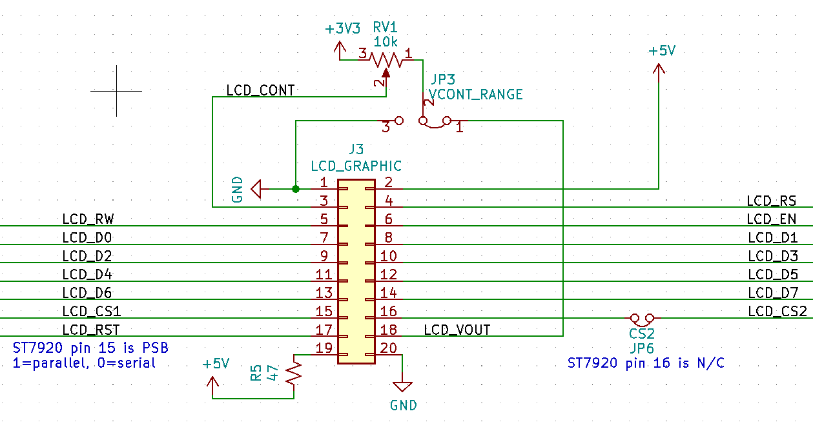

# pic32glcd
Library to allow your project to work with KS0108 and ST7920 LCD controllers

## Function
The KS0108 and ST7920 LCD controllers can both run in 8-bit parallel mode. However they have different memory layouts. This library lets you support both types of controllers, without having to worry about the details. Functions included allow you to copy a picture to the buffer, manipulate it in various ways, and then write it to the screen. (No line/circle/rectangle functions are currently implemented - pull requests welcome).

## How It Works

The library will allocate its own screen buffer called `KS0108Buf` (I called it that because the memory layout is specific to the KS0108). Normally this buffer is 128x64 bits = 1KB. You can use the functions provided in `dispbuf.h` or write to this buffer directly. Then call `GLCD_WriteBufToScreen()` to write the buffer to screen. The library does not support writing parts of the screen (if you want it, please raise an issue - it wouldn't be hard).

ST7920 support allocates a second buffer and whenever `GLCD_WriteBufToScreen()` is called, the KS0108 screen buffer is copied across to the ST7920 buffer, transforming the data to the different memory layout. That buffer is then written to screen.  If you don't need ST7920 support, you can save space by commenting out `#define ST7920_SUPPORT` in `dispbuf.h`.

## Usage

### Setup

1. Copy these source files into your project.
2. Edit `KS0108-config.h` and `ST7920-config.h`. Adjust the macros to reflect the GPIO pins that the LCD is connected to.

### Drawing stuff

See [dispbuf.h](dispbuf.h) and [glcd.h](glcd.h) for function documentation. Note that all drawing functions require you to explicitly pass `KS0108Buf` as the first parameter. This is intended to allow the user use their own buffer and remove the declaration of `KS0108Buf` from `KS0108.c`.

Note that some functions are byte-aligned (i.e. drawing needs to start on row 0/8/16/.. and finish on row 7/15/23/..). This is noted in the description in [dispbuf.h](dispbuf.h).

```
GLCD_Initialize(GLCD_ST7920); // GLCD_KS0108 if you have one of those.
GLCD_ClearScreen();
GLCD_WriteScreen_buf(KS0108Buf, menu); // Write a menu image (defined in a header file, stored in flash) to the buffer
GLCD_Invert_buf(KS0108Buf, 12,12, 70,40); // Invert a rectangular section of the screen
GLCD_WriteBufToScreen();               // Write to screen
```

## Example

The example MPLAB X project in the firmware directory shows how to draw graphics using the library. The schematic below shows how a board can support both boards. JP3 should be connected to GND for ST7920, and should be connected to VOUT (output of the voltage doubler) for KS0108. Personally, I prefer to use 20-pin IDC connectors for the LCD cable (with a small SIL-to-DIL adapter board soldered to the screen).


 

